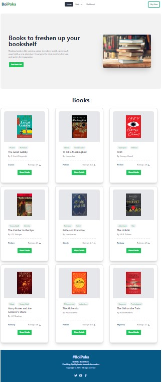

**Project Title: BoiPoka Book Store**

**Overview:** 
**BoiPoka** is a React-based web application for book lovers to discover top-rated books. Users can explore detailed book information, including ratings and pages, from a curated collection of fake JSON data. They can also create a personal list of books they've read, which is stored locally in the browser for easy access on future visits.The web application allows users to sort their reading list by rating or page count and provides smooth navigation across pages. **BoiPoka** offers an intuitive, user-friendly experience for book enthusiasts to track their reading journey and find new books to explore.

**Run The Project Locally:**

**Step-01**
Download this GitHub Repository Link: https://github.com/Muaj00/boi-poka

**Step -02**
- Open the vs code after cloning the folder
- Use ctrl+j (open the terminal)
- Now write in the terminal : npm run dev
- Use ctrl+click the link to open the website.

**ScreenShoot Of the full page of every Route:**

